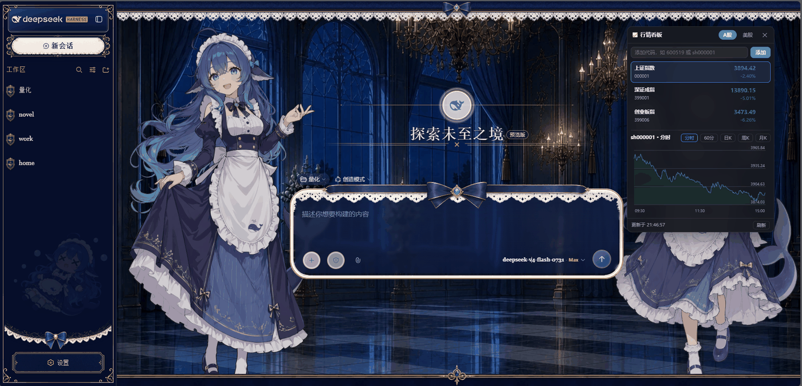

# 📈 DSH 行情看板（DSH Quote Panel）

**[English](README.en.md) | 简体中文**

[DeepSeek Harness](https://github.com/deepseek-ai/DeepSeek-Harness)（dsh web）会话内的实时行情看板：可拖拽、永远置顶的悬浮面板，A股 + 美股，无需任何 API Key、无账号、免费。

[](LICENSE)
[](https://www.npmjs.com/package/dsh-quote-panel)
[](https://github.com/topics/dsh-plugin)
[](package.json)



## ✨ 功能特性

- **A股**：默认页展示三大股指——上证指数（`sh000001`）、深证成指（`sz399001`）、创业板指（`sz399006`）；可添加任意 A 股代码（`600519`、`sh600519`…）
- **美股**：默认页展示三大指数——道琼斯（`DJI`）、纳斯达克综合（`IXIC`）、标普500（`INX`）；可添加任意美股代码（`AAPL`、`TSLA`…）
- **K线**：A股分时 / 60分 / 日K / 周K / 月K；美股日K / 周K / 月K
- **自选管理**：各市场独立自选，增删实时生效，存于浏览器 `localStorage`
- **自动刷新**：行情服务端轮询，A股 5 秒 / 美股 10 秒
- **置顶 + 可拖动**：z-index 压过所有皮肤/主题浮层；按住标题栏可拖到任意位置，位置自动记忆
- **🐂 牛来桌宠（v1.1 新增 · v2.2 多皮肤）**：看板上点 "🐂 牛来" 即可召唤一头会撒欢奔跑的牛，盯 A股 / 美股自选；任一标的 `changePct > 0` 就跑两步 + 文字喊两声 `\牛来/`。直接浮在 DSH 会话页面，跟着页面滚动，自选自动同步。**每次打开都会循环切换形象**（经典牛 / 毛绒牛，皮肤持久化不丢失）
- **零配置**：数据全部来自免费公开接口（腾讯财经），无需申请密钥

## 🚀 安装

> bundle 插件：无需审批弹窗，重启不丢失。

### 一键安装脚本（推荐）

仓库根目录自带两个一键安装脚本（幂等，可重复执行）：

```bash
# Linux / macOS
bash install.sh

# Windows（PowerShell 5.1+）
powershell -NoProfile -ExecutionPolicy Bypass -File install.ps1
```

脚本会自动：复制插件源码 → 在 web profile 的 `package.json` 写入 `dependencies["dsh-quote-panel"]="link:<绝对路径>"` 与 `dsh.profile.bundles` 条目（先备份，幂等）→ 执行 `pnpm install` → 提示重启。可用环境变量 `DSH_PROFILE_DIR` / `DSH_PLUGIN_DIR` 覆盖默认路径。

### 手动安装（各平台通用）

1. 克隆/复制本仓库到你的 `dsh-plugin-download` 目录（或任意位置）。
2. 编辑 web profile 的 `package.json`（默认 `~/.dsh/profiles/web/package.json`）：
   - `dependencies` 增加：`"dsh-quote-panel": "link:<本仓库绝对路径>"`
   - `dsh.profile.bundles` 增加：`"dsh-quote-panel"`
3. 在 profile 目录执行 `pnpm install`。
4. 重启 `dsh web`，在会话页顶栏点击 **📈 行情** 按钮。

### 从 npm / GitHub Releases 安装（v2.0 已发布）

```bash
# npm
npm i -g dsh-quote-panel
# 或像其他 dsh bundle 插件一样加进 profile 依赖
```

GitHub Releases 页面会附带 `dsh-quote-panel-install.tar.gz` 安装包（含插件本体 + `install.sh`，适合全新环境直接解压进 profile 的 `node_modules`）。

## 🛠 使用

1. 打开 dsh 会话页面，点击会话顶栏右侧的 **📈 行情**。
2. 用 **A股 / 美股** 页签切换市场。
3. 在输入框输入代码，点 **添加** 扩展自选；悬停列表行点 **✕** 移除。
4. 点击任意行查看 K线，用按钮切换周期（分时 / 60分 / 日K / 周K / 月K）。
5. 面板挡住内容时，按住标题栏拖动即可，位置会被记住。

## 🐂 牛来桌宠（🐮 Desk Pet）

看板头部点击 **🐂 牛来**，打开后一头牛会浮在页面底部左右徘徊。每当自选列表里**任一标的实时上涨（`changePct > 0`）**，牛立刻：

1. 跑两步（在 1.6 秒里走完横向 78px + 两跳）
2. 停下
3. 弹出黄色对话泡，大字 `\牛来/`，下方一行小字列出当前在涨的几只标的（如 `贵州茅台 +1.32% · 上证指数 +0.21%`）
4. 同一波上涨节流约 1.8 秒，避免连刷
5. 标的回落时（不再有上涨）牛恢复安静漫步，对话泡消失

数据源与上面看板一致——复用 `/dshq/quotes`，所以**完全零额外接口**。

### 关闭桌宠

看板标题里的高亮按钮变回 **🐂 关掉牛** 即可关闭。

## 🗂 数据来源与免责声明

| 市场 | 行情 | K线 |
|---|---|---|
| A股 | 腾讯 `qt.gtimg.cn` | 腾讯 `ifzq.gtimg.cn`（分时 / 60分 / 日 / 周 / 月） |
| 美股 | 腾讯 `qt.gtimg.cn` | 腾讯 `ifzq.gtimg.cn`（日 / 周 / 月） |

- 所有接口均为免费公开 Web 接口，可能随时变动、限流或失效；面板会优雅降级并显示错误信息。
- **不构成投资建议。** 数据仅供学习研究，任何交易决策请以券商数据为准。
- 美股**没有分时**（腾讯免费接口不提供美股盘中），K线为日级及以上。

## 💬 常见问题（FAQ）

**Q: 需要申请 API Key 吗？**
A: 完全不需要。所有行情数据来自腾讯财经免费公开接口，零配置零成本。

**Q: 为什么美股没有分时图？**
A: 腾讯免费接口不提供美股盘中分时数据，K线为日级及以上。这是数据源限制，非插件缺陷。

**Q: 行情不更新了/显示错误怎么办？**
A: 免费接口可能被限流或临时失效，面板会显示错误信息并自动重试。可点击面板底部「刷新」手动触发；若长时间异常，多为接口方限制，稍后再试。

**Q: 牛来桌宠为什么有时候不喊？**
A: 牛来只在你自选列表里**有标的上涨（`changePct > 0`）**时触发，且同一波上涨有节流（网页版 1.8s，桌面版 8s + 70% 概率）。全绿/休市时它安静散步是正常行为。

**Q: 自选列表存在哪里？会不会丢？**
A: 存在浏览器 `localStorage`（`dshq.lists.cn/us`），刷新页面、重启浏览器都会保留。清除浏览器站点数据才会清空。

**Q: 气泡/牛挡住界面了怎么办？**
A: 面板可按住标题栏拖走（位置记忆）；牛来在网页版里浮于页面底部，看板内点「🐂 关掉牛」即可关闭。

**Q: 支持哪些浏览器？**
A: 任意现代浏览器（Chrome / Edge / 夸克 / Firefox / Safari）及 Android WebView；面板支持触摸拖动。

## 🤝 贡献

欢迎 PR 与 Issue！小贴士：

- 代码风格：ESLint 默认 + 2 空格缩进；`lib/` 为宿主与客户端源码，`desktop-pet/` 为独立 Electron 应用
- 提交前跑一遍检查：`pnpm check`（或 `npm run check`）
- 数据源、兼容性、免责声明相关改动请在 PR 描述里注明验证环境
- 中文交流友好：Issue 可以用中文写

## 🗺 路线图（Roadmap）

- [ ] **自选分组/排序**：多分组自选、拖拽排序
- [ ] **更多市场**：港股、加密货币行情页签
- [ ] **K线叠加指标**：MA / MACD / KDJ 切换
- [ ] **自定义气泡样式**：字号、配色、喊话语录可配置
- [ ] **Electron 桌宠打包发布**：提供 Windows/macOS 现成安装包

## ⚙️ 兼容性

- dsh web（服务端：Node ≥ 20，依赖 dsh 核心自带的 `webServer` 服务）
- 浏览器端：任意现代浏览器 / Android WebView（面板支持触摸拖动）
- 已在 Linux、Windows 部署上实测

## 🛠 开发

```bash
pnpm check   # 对 host 与 client 源码做语法检查
```

## 📄 许可证

[MIT](LICENSE) © 2026 dsh-quote-panel contributors
