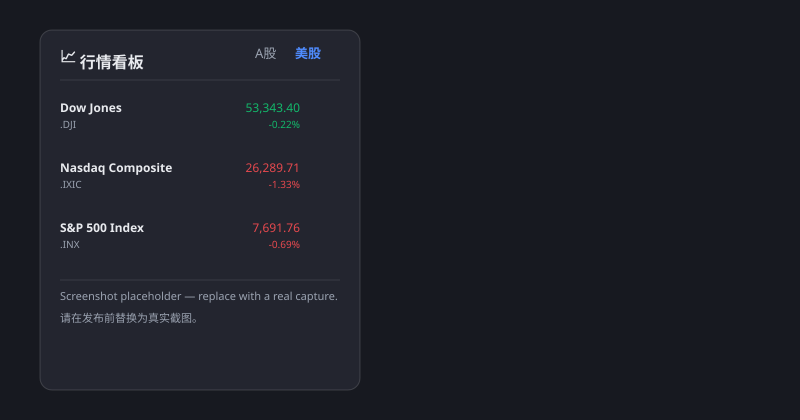

# 📈 DSH 行情看板（DSH Quote Panel）

[DeepSeek Harness](https://github.com/deepseek-ai/DeepSeek-Harness)（dsh web）会话内的实时行情看板：可拖拽、永远置顶的悬浮面板，A股 + 美股，无需任何 API Key、无账号、免费。

[](LICENSE)



## ✨ 功能特性

- **A股**：默认页展示三大股指——上证指数（`sh000001`）、深证成指（`sz399001`）、创业板指（`sz399006`）；可添加任意 A 股代码（`600519`、`sh600519`…）
- **美股**：默认页展示三大指数——道琼斯（`DJI`）、纳斯达克综合（`IXIC`）、标普500（`INX`）；可添加任意美股代码（`AAPL`、`TSLA`…）
- **K线**：A股分时 / 60分 / 日K / 周K / 月K；美股日K / 周K / 月K
- **自选管理**：各市场独立自选，增删实时生效，存于浏览器 `localStorage`
- **自动刷新**：行情服务端轮询，A股 5 秒 / 美股 10 秒
- **置顶 + 可拖动**：z-index 压过所有皮肤/主题浮层；按住标题栏可拖到任意位置，位置自动记忆
- **零配置**：数据全部来自免费公开接口（腾讯财经），无需申请密钥

## 🚀 安装

> bundle 插件：无需审批弹窗，重启不丢失。

### 本地源码安装（各平台通用）

1. 克隆/复制本仓库到你的 `dsh-plugin-download` 目录（或任意位置）。
2. 编辑 web profile 的 `package.json`（默认 `~/.dsh/profiles/web/package.json`）：
   - `dependencies` 增加：`"dsh-quote-panel": "link:<本仓库绝对路径>"`
   - `dsh.profile.bundles` 增加：`"dsh-quote-panel"`
3. 在 profile 目录执行 `pnpm install`。
4. 重启 `dsh web`，在会话页顶栏点击 **📈 行情** 按钮。

Windows 下同样用 PowerShell 操作；全新环境也可直接把包复制进 profile 的 `node_modules`（见发布包中的 `install.sh`）。

### 从 npm / GitHub Releases 安装（发布后）

```bash
# npm
npm i -g dsh-quote-panel
# 或像其他 dsh bundle 插件一样加进 profile 依赖
```

## 🛠 使用

1. 打开 dsh 会话页面，点击会话顶栏右侧的 **📈 行情**。
2. 用 **A股 / 美股** 页签切换市场。
3. 在输入框输入代码，点 **添加** 扩展自选；悬停列表行点 **✕** 移除。
4. 点击任意行查看 K线，用按钮切换周期（分时 / 60分 / 日K / 周K / 月K）。
5. 面板挡住内容时，按住标题栏拖动即可，位置会被记住。

## 🗂 数据来源与免责声明

| 市场 | 行情 | K线 |
|---|---|---|
| A股 | 腾讯 `qt.gtimg.cn` | 腾讯 `ifzq.gtimg.cn`（分时 / 60分 / 日 / 周 / 月） |
| 美股 | 腾讯 `qt.gtimg.cn` | 腾讯 `ifzq.gtimg.cn`（日 / 周 / 月） |

- 所有接口均为免费公开 Web 接口，可能随时变动、限流或失效；面板会优雅降级并显示错误信息。
- **不构成投资建议。** 数据仅供学习研究，任何交易决策请以券商数据为准。
- 美股**没有分时**（腾讯免费接口不提供美股盘中），K线为日级及以上。

## ⚙️ 兼容性

- dsh web（服务端：Node ≥ 20，依赖 dsh 核心自带的 `webServer` 服务）
- 浏览器端：任意现代浏览器 / Android WebView（面板支持触摸拖动）
- 已在 Linux、Windows 部署上实测

## 🛠 开发

```bash
pnpm check   # 对 host 与 client 源码做语法检查
```

## 📄 许可证

[MIT](LICENSE) © 2026 dsh-quote-panel contributors
